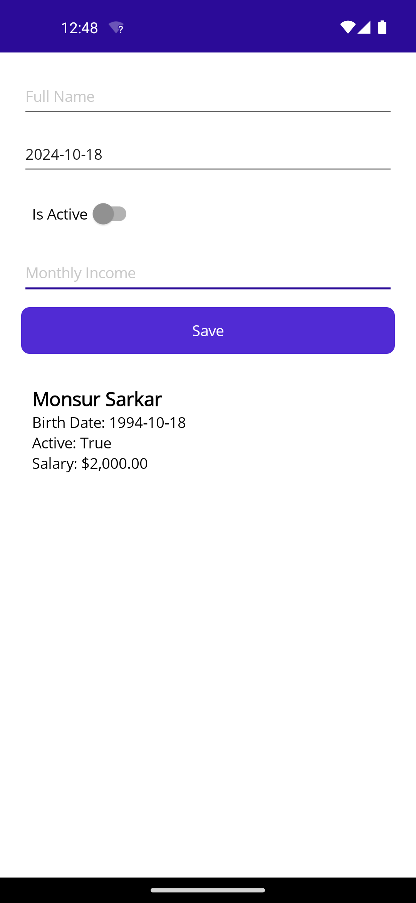
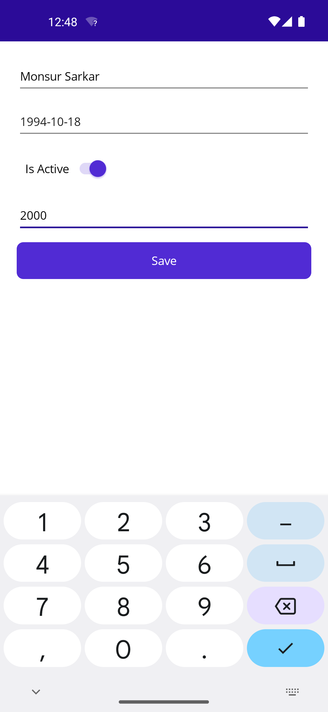
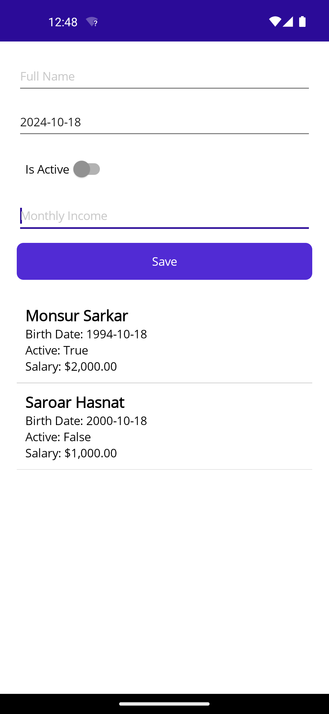
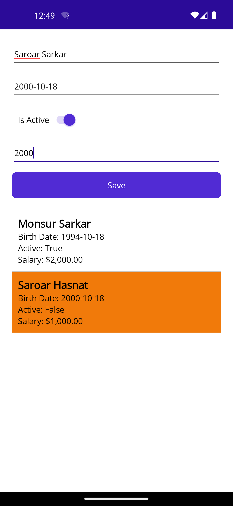
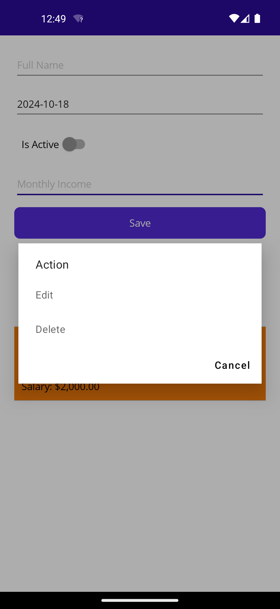
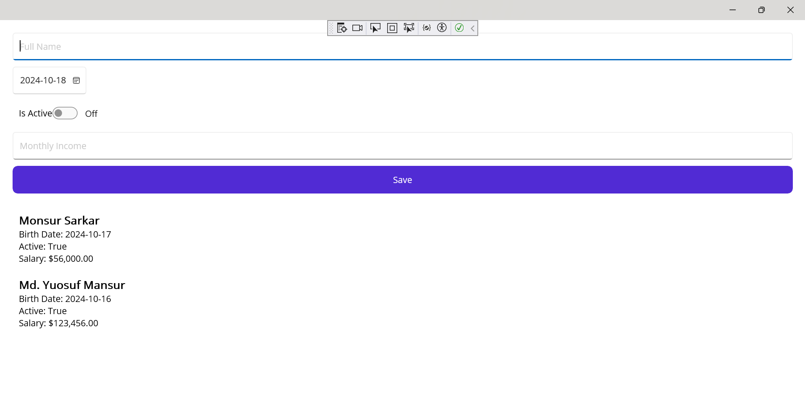
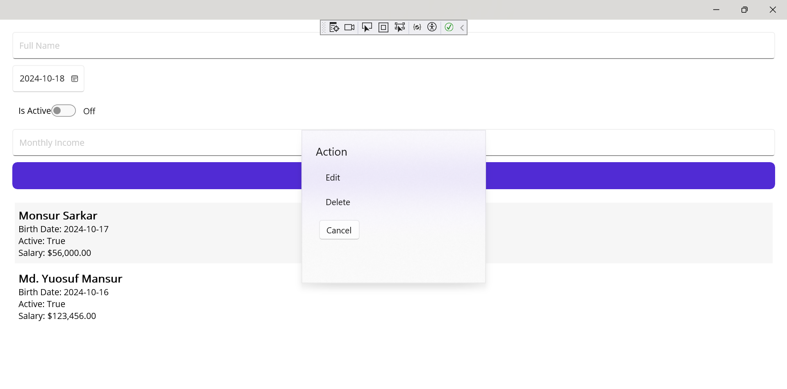

---

# .NET MAUI CRUD Application with SQLite

This project is a simple CRUD (Create, Read, Update, Delete) application built with .NET MAUI and SQLite. It demonstrates how to efficiently perform CRUD operations using modern cross-platform application development technologies.

## Features

- .NET MAUI framework for cross-platform mobile and desktop applications
- SQLite for local database access
- MVVM architecture
- Simple and intuitive UI

## Prerequisites

- .NET SDK 8 (Long-Term Support)
- Visual Studio 2022 (with MAUI workload installed)
- SQLite for local data storage

## Installation

1. Clone the repository:
   
   ```bash
   git clone https://github.com/yousuf-mansur/aritst-profile-sqlLite-crud.git
   ```

2. Open the project in Visual Studio:
   - Open the `.sln` file in Visual Studio.

3. Restore NuGet packages (if necessary):
   - Go to **Tools > NuGet Package Manager > Package Manager Console**.
   - Run the following command to restore the packages:
     
     ```bash
     dotnet restore
     ```

4. Set up SQLite (if necessary):
   - The application is configured to use SQLite as the local database.
   - Ensure the SQLite database is created and migrations are applied.

## Running the Application

1. Press `F5` or click the Start button in Visual Studio to run the application.
2. The application will open in your default platform emulator (Android/iOS) or as a desktop application (Windows/macOS).

## Images View

### List of Artist


### Insert Artist Data


### Another Artist List


### Edit Artist Data


### After Edit List


### Edit and Delete Action


### Windows Version List


### Windows Version Other Action


## Usage

You can now perform CRUD operations on artist entities. The application uses SQLite to store and retrieve data, and provides a smooth user experience across platforms.

## Project Structure

- `ViewModels/` - Contains the MVVM ViewModels for data binding and logic.
- `Models/` - Contains the SQLite models and data access logic.
- `Views/` - Contains the XAML views for rendering the UI.
- `Services/` - Contains services for handling data operations and business logic.

## Technologies Used

- .NET MAUI (Cross-Platform)
- SQLite for local data storage
- MVVM architecture

## Contributing

1. Fork the repository.
2. Create your feature branch (`git checkout -b feature/AmazingFeature`).
3. Commit your changes (`git commit -m 'Add some AmazingFeature'`).
4. Push to the branch (`git push origin feature/AmazingFeature`).
5. Open a pull request.

## About Me

I am Md. Yousuf Mansur, a full-stack developer specializing in web and cross-platform application development. My skills include:

- .NET MAUI for mobile and desktop applications
- ASP.NET MVC and ASP.NET Core for web development
- Angular and React for front-end development
- Entity Framework and Entity Framework Core
- SQLite and SQL Server database management
- RESTful APIs and Web Services

My journey in software development began in 2023 with an IsDB-BISEW scholarship, and I have completed the course at Star Computer Systems Limited.

With over a year of experience in development, I am proficient in modern technologies, enabling me to build both web and cross-platform applications.

- Contact me for your project
- E-mail: mansurmdyousuf@gmail.com
- WhatsApp: +880 1719983377
- LinkedIn: [Md. Yousuf Mansur](https://www.linkedin.com/in/md-yousuf-mansur/)

---
